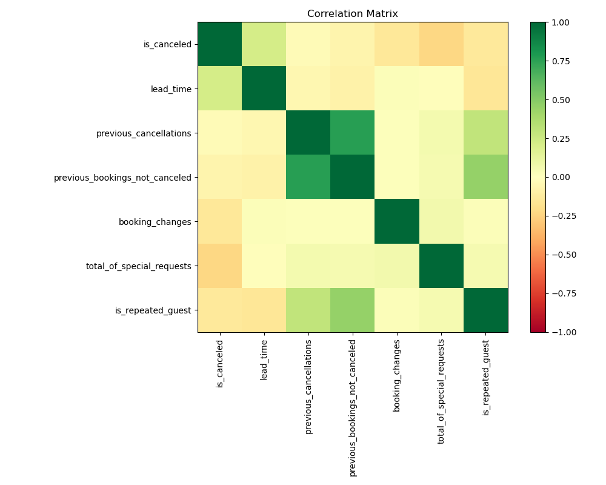
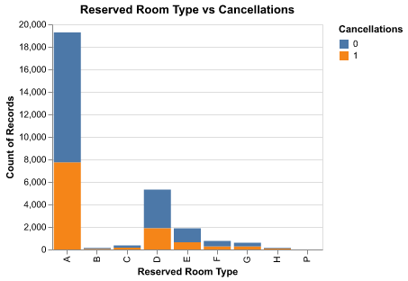
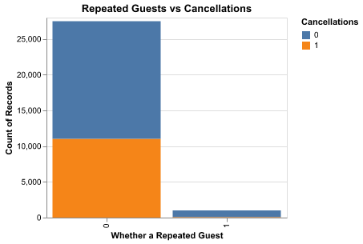
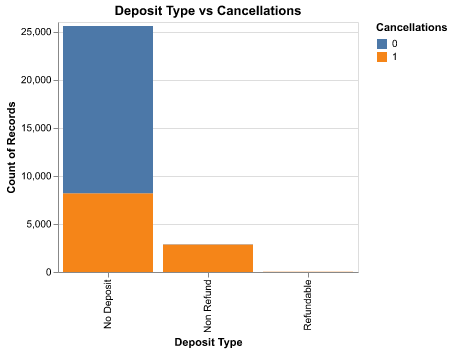
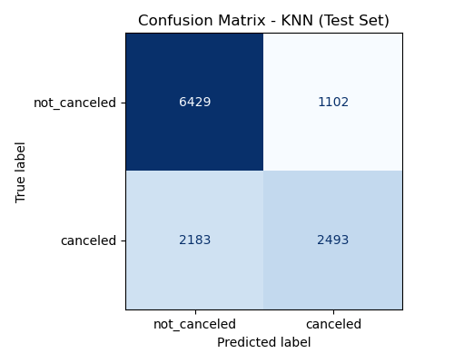
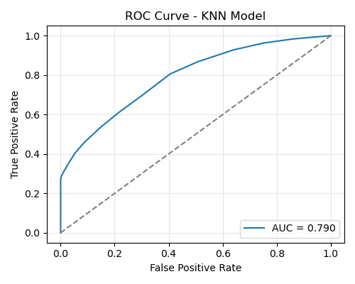

# Summary

In this project we worked with an open hotel booking dataset containing reservations for both city and resort hotels and we selected a smaller set of features that would realistically be available at the time of booking, such as lead time, whether the guest is a repeat customer, previous cancellations, booking changes, special requests, reserved room type and deposit type. After a brief exploratory analysis, we confirmed that cancellations are fairly common and that patterns differ across hotel types and booking conditions, especially for repeated guests and deposit policies. We then framed the problem as a binary classification task: predict whether a booking will be cancelled or not. The data was split into training and test sets, and we built pipelines that combined preprocessing with three models: K-Nearest Neighbours, a Decision Tree and an RBF-kernel SVM.

Using 5-fold cross validation with F1 score on the validation set, KNN gave the best performance, so we chose it as our final model and evaluated it on the unseen test data. On the test set, our KNN model performs well enough with an accuracy of 73% and we concluded that it could plausibly support day-to-day hotel operations, at least as a first-pass tool for flagging higher-risk bookings. The confusion matrix shows that the model correctly identifies most non-cancellations and captures a reasonable portion of true cancellations, even though it still misses some risky bookings. That said, we do not see it as a finished solution. There is clear value in extending the feature set, tuning the model more carefully, and examining in detail which types of reservations are consistently mis-classified. This would not only improve raw performance, but also give hotels a better sense of when to rely on the model’s predictions and when they should be treated as one input alongside staff experience and existing booking policies.

# Introduction

Free cancellations for hotel bookings are increasingly popular nowadays, but cancellations create significant impact on a hotel's revenue and operation. Predicting whether a reservation will be canceled can help hotels manage resources more effectively, reduce lost revenue, and improve customer service. There has been a rise in the research conducted on predicting hotel cancellations using machine learning models in order to improve strategies for revenue management [@sanchez2020; @antonio2017]. In our project, we aim to answer the question "Can we build a model that accurately predicts whether a hotel booking will be canceled?" This will be a binary classification problem, where each booking is labeled as either “canceled” or “not canceled”.

To explore this, we used a publicly available dataset from [GitHub](https://raw.githubusercontent.com/manthangandhi/hotel_cancellation_prediction/refs/heads/main/data/hotel_bookings.csv). The dataset contains information about hotel reservations, and the label column is called "IsCanceled", which indicates whether a booking was canceled or not. One of the important features is "Lead Time", showing how many days passed between the booking date and the arrival date. Some other important features include deposit type, is_repeated_guest and booking_changes, which are all helpful for our classification model and have been used in previous work done that has also conducted predictive modeling on hotel cancelations [@antonio2019_dataset].

# Question of Interest
Since the dataset contains many features (32 in total), we chose to examine a subset of these in order to focus our research question to the following:
**Can we predict hotel cancellations from booking lead time and different types of guest behaviors, using hotel booking information from the year 2017? And do cancellations differ across hotel type?**

# Methods

## Data

We began by cleaning the dataset and selecting the columns that we considered most useful for our research question. Our analysis depends on the following columns as predictors: hotel, is_canceled, lead_time, previous_cancellations,previous_bookings_not_canceled, booking_changes,total_of_special_requests, is_repeated_guest, deposit_type and reserved_room_type.

To ensure quality and integrity of the data prior to modelling, we used the pandera package to conduct a series of validation checks. These checks enforced correct column name and column types, valid category levels and numerical bounds for our predictor variables. We then performed exploratory data analysis (EDA) to examine the distribution of our predictor variables across different levels of our target variable, 'is_canceled'.

For predictive modeling, we conducted cross validation on 3 different models: KNN, SVM RBF and Decision trees, using our training data. The best performing model (KNN) was then evaluated on the test set to assess whether it generalizes well to unseen data and evaluate how well it was able to correctly predict guests that cancel their hotel reservations versus those who do not.Since the entire dataset is quite large, we'll be focusing on hotel data from the most recent year, the year 2017, to make predictions about hotel cancellations (as per the research question).

## Analysis

The correlation matrix (@fig-corrmatrix) helped us assess how our selected numerical features relate to one another and to the target variable, is_canceled. Overall, the matrix shows that most predictors have only weak linear relationships with cancellations, which suggests that no single booking feature is strongly determinant on its own. This aligns with our expectation that cancellation behavior is influenced by several interacting factors rather than a single dominant one. We do, however, observe some stronger correlations among the guest history features: lead_time, previous_cancellations, and previous_bookings_not_canceled are highly related, reflecting that guests with long booking horizons tend to be more frequent travelers with greater booking histories. These relationships are not necessarily indicative of cancellation risk themselves, but they confirmed that our predictor set contains overlapping behavioral signals that the model will need to note.

::: center
{#fig-corrmatrix width="70%"}
:::

We can observe from @fig-eda-bars that almost all cancellations are happening for new guests. Repeated guests who have previously booked with the hotel before do not seem to cancel much. In addition, the majority of cancellations occur for guests who have booked room type A. Interestingly, guests seem to cancel more when they have not provided a deposit on their booking and some also cancel when their deposit is non refundable.

One small but notable pattern is the slight negative correlation between total_of_special_requests and is_canceled, suggesting that guests who invest more effort in customizing their stay may be somewhat less likely to cancel. Although this relationship is modest, it supports our decision to include special requests in the feature set, as even weak signals can help a classification model refine its decision boundary. Similarly, mild positive correlations between lead_time and is_canceled indicate that far-in-advance bookings tend to cancel slightly more often, a trend also reported in the hotel cancellation literature [@antonio2019_bigdata; @antonio2019_dataset].

::::::: {#fig-eda-bars .column-page fig-cap="EDA bar plots: Reserved Room Type, Repeated Guest Status, and Deposit Type vs Cancellations."}
:::::: columns
::: {.column width="33%"}
{width="50%" height="250px"}
:::

::: {.column width="33%"}
{width="50%" height="250px"}
:::

::: {.column width="33%"}
{width="50%" height="250px"}
:::
::::::
:::::::

# Results & Discussion

```{python}
#| echo: false
import pandas as pd
acc_df = pd.read_csv("../results/tables/test_accuracy.csv")
knn_test_accuracy = float(
    acc_df.loc[acc_df["metric"] == "test_accuracy", "value"].iloc[0]
)
knn_test_accuracy_3dp = round(knn_test_accuracy, 3)
```

With this project, our primary goal was to predict the whether a hotel booking would eventually end up being cancelled, using information that is available at the time of booking including lead time, deposit type, room type and whether the guest is a repeat customer etc. The idea is that a reasonably accurate model could help hotel businesses flag high-risk bookings and adjust their policies or communication before the stay date.

For the purpose of getting the best model to do this prediction, we compared three classification models using 5-fold cross validation on the training set, with F1 score (for the cancellation class) as the main metric, **K-Nearest Neighbours (KNN, k = 15), Decision Tree (max_depth = 6), and RBF-kernel SVM (C = 1.0, gamma = “scale”).** After scoring their mean F1 scores on the training folds, the F1 score results were: F1 = 0.602 for KNN, F1= 0.57 for Decision Tree and F1=0.526 for RBF SVM. KNN clearly performed best on this metric, and also consistently across the folds with the least standard deviations. Because our main concern is to correctly identify cancellations rather than just overall accuracy, we chose **KNN** as the final model for evaluation on the test set.

::: center
{#fig-knnconfusion width="70%"}
:::

As shown in @fig-knnconfusion, the KNN model achieved an accuracy of `{python} knn_test_accuracy_3dp`. Other stats are as follows:

-   Cancellation Precision ≈ 0.70
-   Cancellation Recall ≈ 0.53
-   Cancellation F1 ≈ 0.60
-   Non-Cancellation Precision ≈ 0.75
-   Non-Cancellation Recall ≈ 0.86
-   Non-Cancellation F1 ≈ 0.80

The averaged F1 is close to 0.70, which is close to what we saw in the cross validation for the cancellation class. This suggests that the model do generally well enough and does not drastically overfit the training data.

If we assume a rough baseline of always predicting “not cancelled”, the model would give an accuracy of 62%. So looking into that, our KNN model improves this by about 73% which also provides a meaningful recall for the cancellation class. Our model leans slightly towards being a bit cautious about over-flagging cancellations (higher position than recall for positive class). But in practice, this is acceptable, as the hotel would want to avoid annoying, loyal and serious guests with extra checks, but it also would be very useful in catching more of these genuinely risky bookings.

::: center
{#fig-knnroc width="70%"}
:::

The ROC curve for the KNN model, @fig-knnroc, shows how well the classifier can distinguish between cancelled and non-cancelled bookings across all possible classification thresholds. The curve rises well above the diagonal baseline, indicating that the model performs substantially better than random guessing. At lower false positive rates, the true positive rate increases steadily, suggesting that the model can identify a meaningful proportion of cancellations even when constrained to make very few false alarms. The curve becomes steeper as the threshold relaxes, reflecting that the model captures more cancellations at the cost of some additional false positives—a trade-off that is expected in this type of classification problem. The dotted line in the ROC curve represents the baseline of random guessing, where the true positive rate equals the false positive rate. Here, it can serve as a reference to show how much better our model performs compared to chance.

The AUC value of 0.79 provides a concise summary of this performance. An AUC of 0.79 indicates good discriminatory ability, meaning that in roughly 79% of random pairings between a canceled and a non-canceled booking, the model assigns a higher cancellation probability to the canceled booking. Although this is not exceptionally high, it is noticeably stronger than a naive baseline and aligns with the F1 and accuracy scores observed in earlier evaluations. Overall, the ROC curve reinforces that the KNN model captures meaningful patterns in guest behavior and booking characteristics, even though there remains room to improve its ability to detect more of the truly high-risk cancellations.

**Limitations to keep in mind when interpreting :**

-   **Feature and dataset limitations:** The dataset has restricted us with booking data from only one year - 2017, and also it is taken from a mix for too many countries. This simplifies the problem but may limit how well the model generalizes to other years with different travel patterns or external events. The analysis might differ from location to location and country to country. We used a small, curated set of features thus including more information (such as market segment, distribution channel, length of stay or country) could help the model learn more subtle patterns and improve recall for cancellations.
-   **No hyperparameter tuning yet:** We used fixed hyperparameters (e.g., k = 15 for KNN) rather than performing a grid search or randomized search. Systematic tuning could yield a better balance between precision and recall for the cancellation class.
-   **Single threshold:** We used the default decision threshold of 0.5. For a real hotel, it might be better to adjust this threshold depending on whether they are more concerned about missed cancellations or about over-flagging guests.

**Overall takeaway:**

In overall, the KNN model provides a **useful starting point** for predicting hotel booking cancellations. It clearly outperforms a simple majority baseline, correctly identifies most non-cancellations and captures a meaningful portion of actual cancellations. With additional tuning, more features and a more careful treatment of missing values and thresholds, this approach could be developed into a practical decision support tool to help hotels manage overbooking strategies, communicate proactively with high-risk guests and reduce the last minute revenue losses.

# References
